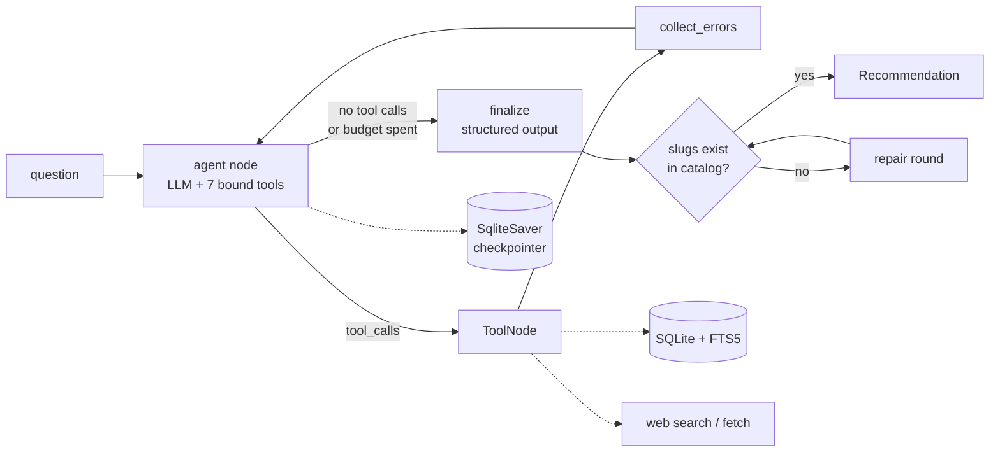

# ModelPilot

A single-agent, tool-calling system that answers *"which AI model should I use?"* against the
catalog in this repository — and can't invent a model while doing it.

```
$ uv run modelpilot ask "cheapest model with at least 500K context that's good at
                         coding and on Bedrock — cost for 50M in / 5M out per month?"

  call   query_models   {"min_context": 500000, "strengths": ["coding"],
                         "availability": ["bedrock"], "sort": "cheapest"}
  result query_models   4 models
  call   compare_costs  {"slugs": [...], "input_tokens_per_month": 50000000, ...}
  result compare_costs  ranked cheapest-first

  Claude Sonnet 5 at $225/month. Cheapest model clearing all three constraints…

  #  Model            Slug                        Monthly
  1  Claude Sonnet 5  anthropic-claude-sonnet-5   $225.00
  2  Claude Opus 5    anthropic-claude-opus-5     $375.00
```

Live demo: `/agent` on the site · Source: this directory.

---

## Why this project exists

Most "AI agent" demos are a chat loop with a weather tool. This one is built on a real corpus —
the 31 models in [`content/models/`](../content/models), each with validated frontmatter for
pricing, context window, modalities, availability, strengths, and benchmark scores — so its
answers are checkable. If the agent says Sonnet 5 costs $225/month at 50M input tokens, you can
verify the arithmetic against the published price yourself.

The interesting engineering problem here isn't calling a tool. It's making the output
**trustworthy**: grounding every claim in a database, doing arithmetic in Python instead of in
the model, and making it structurally impossible to return a model that doesn't exist.

## Architecture



| Concern | Where | What it does |
| --- | --- | --- |
| Tool calling | [`tools/`](src/modelpilot/tools) | 7 tools, Pydantic arg schemas, bound with `bind_tools()` |
| Agent loop | [`graph.py`](src/modelpilot/graph.py) | LangGraph `StateGraph`, conditional edges, step + tool-call budgets |
| State | [`graph.py`](src/modelpilot/graph.py) | `AgentState` TypedDict + `SqliteSaver`, keyed by thread id |
| Errors & retries | [`retry.py`](src/modelpilot/retry.py) | Error taxonomy, tenacity backoff, circuit breaker |
| Structured output | [`schemas.py`](src/modelpilot/schemas.py) | `Recommendation` model + the anti-hallucination guard |
| Data | [`ingest.py`](src/modelpilot/ingest.py), [`db.py`](src/modelpilot/db.py) | MDX → SQLite with an FTS5 index |
| Evals | [`evals/`](evals) | 15 golden questions scored on behavior |

## The tools

| Tool | Purpose |
| --- | --- |
| `query_models` | Structured catalog filters → parameterized SQL. The model never writes SQL. |
| `get_model` | One model's full record. An unknown slug returns the list of real slugs. |
| `search_model_docs` | BM25 full-text search over the prose write-ups, for qualitative trade-offs. |
| `estimate_cost` | Exact monthly cost for one model at a token volume. |
| `compare_costs` | Same, for several models, ranked cheapest-first. |
| `calculate` | Ad-hoc arithmetic through an AST-whitelisted evaluator — no `eval`. |
| `web_search` / `fetch_url` | The open internet, for questions the catalog can't answer. |

## Three things worth a closer look

### 1. The agent cannot return a model that doesn't exist

`finalize` validates every `pick.slug` against the database. On a miss, the model gets exactly
one repair round with the validation errors and the real slug list attached. If it still can't
ground a pick, the pick is **stripped** rather than shipped, confidence drops to `low`, and the
removal is disclosed in `assumptions`.

```python
def test_every_returned_slug_always_exists_in_the_catalog(monkeypatch):
    """The invariant that matters: whatever happens, we never emit a fake model."""
```

That test drives four scenarios — clean, repaired, partially repaired, and unrepairable — and
asserts the invariant holds in all of them. Two eval cases attack it from the other side, asking
about a model and a benchmark that don't exist.

### 2. Arithmetic happens in Python, not in the model

Language models are unreliable at multi-step arithmetic and completely reliable at calling a
function. `estimate_cost` reads prices from SQLite and computes
`(tokens/1e6) * price_per_1m` in Python; the prompt tells the model to copy the result rather
than recompute it. A test cross-checks the cost tool against the independent AST calculator, so
the two paths have to agree.

### 3. Failures are data, not exceptions

A tool that raises kills the run. Every tool here catches, classifies, and returns:

```json
{"error": "HTTP 503 from example.com", "tool": "fetch_url", "retryable": true,
 "hint": "Transient failure after retries. Try a different source or continue without it."}
```

Retryable errors (timeouts, connection resets, 429, 5xx) back off with jitter; fatal ones
(400s, bad arguments, blocked hosts) fail fast without burning the retry budget. After three
consecutive failures a circuit breaker disables the tool for the session and tells the model to
stop trying. `--chaos 0.5` injects synthetic failures so you can watch it work.

## Running it

```bash
cd agent
uv sync
cp .env.example .env          # add your ANTHROPIC_API_KEY

uv run modelpilot ingest      # build catalog.db from ../content/models/*.mdx
uv run modelpilot stats

uv run modelpilot ask "which model is best for long-horizon agentic work?"
uv run modelpilot ask -t chat1 "what's the cheapest model with 1M context?"
uv run modelpilot ask -t chat1 "what if I only need 200K?"   # follow-up keeps context
uv run modelpilot ask --chaos 0.5 -v "..."                   # watch retries recover
uv run modelpilot ask --json "..."                           # raw structured output
```

Tests and evals:

```bash
uv run pytest -q                      # 74 tests, no API key needed
uv run python evals/run_evals.py      # golden questions (needs a key)
uv run python evals/run_evals.py -k cost --markdown
```

The web API:

```bash
uv run uvicorn modelpilot.server:app --reload --port 8000
curl localhost:8000/health
```

## Testing strategy

The deterministic 90% runs without an API key. Tool behavior, SQL filters, cost math, the
calculator's sandbox, retry classification, the circuit breaker, and every branch of the
anti-hallucination guard are unit-tested with scripted fake models — so control flow is verified
exactly rather than sampled.

The eval harness covers what unit tests can't: whether the model *chooses* the right tools.
Each case asserts on behavior — tools called, tools avoided, slugs recommended, cost within
tolerance, assumptions stated — never on phrasing.

```
$ uv run python evals/run_evals.py
                       ModelPilot evals — <n>/15 passed
  case                                ok  steps    s      $  tools
  cheapest-long-context-coding-...    …
```

> **Paste your own run here.** The table above shows the output shape only — it is not a
> recorded result. This repo has no API key in CI, so the eval suite has not been run against a
> live model yet.

## Deploying

The demo page calls a Next.js route handler (`app/api/agent/route.ts`), which proxies to this
service — so the backend URL stays server-side and the browser only talks to one origin. Without
`AGENT_API_URL` set, the route replays a recorded run and the page labels it as such, so a Vercel
deploy without a backend still works.

```bash
docker build -f agent/Dockerfile -t modelpilot .   # from the repo root
docker run -p 8000:8000 -e ANTHROPIC_API_KEY=sk-ant-... modelpilot
```

Then set `AGENT_API_URL=https://your-service.onrender.com` in Vercel. The public endpoint is
rate-limited per IP and capped by a daily query budget, since it runs on a personal API key.

## Notes and limitations

- **Search is lexical, not semantic.** FTS5/BM25 over ~30 documents is the right tool at this
  size; embeddings would be premature. At 10× the corpus that changes.
- **The catalog is a snapshot.** The agent can search the web to check for newer models, but it
  treats web results as unverified and cites them separately from catalog facts.
- **One agent, not many.** A supervisor with specialist sub-agents would add latency and cost
  without improving answers at this scope.
- **`temperature` is deliberately unset.** It's rejected with a 400 on Claude Opus 5, and
  thinking is on by default there and shares the `max_tokens` ceiling with the response — hence
  the generous default budget.

## What I'd do next

- Semantic search over the write-ups once the corpus outgrows BM25.
- Prompt caching on the system prompt and tool schemas — the biggest cost lever, untouched here.
- Trace persistence with a replay viewer, so eval failures can be debugged after the fact.
- A confidence-calibration eval: does `high` confidence actually correlate with correctness?
